# LearnWise — Software Design Document

**Document Version:** 1.0  
**Classification:** Technical Design Reference  
**Prepared For:** Stakeholder & Client Presentation  
**Platform:** LearnWise — AI-Powered Language Learning Platform  
**Stack:** FastAPI (Python 3.10) · React 18 + Vite · PostgreSQL · Groq LLaMA-3 · OpenAI Whisper

---

## DOCUMENT OVERVIEW

This Software Design Document (SDD) is prepared to industry standards (IEEE Std 1016) and provides a complete visual and descriptive architecture of the LearnWise platform. It is organized into four canonical diagram categories used in software engineering:

| Section | Diagram Type | Purpose |
| :--- | :--- | :--- |
| [Section 1](#section-1-class-diagrams) | Class Diagrams | Static structure — all classes, attributes, methods, and associations |
| [Section 2](#section-2-sequence-diagrams) | Sequence Diagrams | Dynamic behavior — time-ordered message flows between components |
| [Section 3](#section-3-activity-diagrams) | Activity Diagrams | Process flows — swimlane-based workflows for all user journeys |
| [Section 4](#section-4-state-diagrams) | State Diagrams | Stateful entities — all state machines across backend and frontend |

---

## SYSTEM CONTEXT

LearnWise is a full-stack AI language learning platform. Users progress through a hierarchical curriculum: **Language Pair → Month → Block → Activity**. Each block contains 8 activity types graded by either local MCQ scoring or the Groq LLaMA-3 AI API. Audio-based activities (Speaking, Pronunciation) are transcribed using an on-premise OpenAI Whisper model. All progression data is persisted to PostgreSQL, with XP accumulation and social leaderboards driving engagement.

**Architecture Layers:**
```
Browser (React 18 + Redux Toolkit + Axios)
         ↕ HTTPS / REST JSON
FastAPI Backend (Uvicorn · Python 3.10)
   ├── Routers: Auth · Users · Progress · Validate · Speech · Leaderboard · Friends · Admin · Content
   ├── Services: GroqService · WhisperService · ScoringService · ContentService
   └── Core: Security (JWT+bcrypt) · Database (SQLAlchemy ORM) · Dependencies · Config
         ↕ SQLAlchemy
PostgreSQL Database
         ↕ HTTP
Groq Cloud API (LLaMA-3-8B)     OpenAI Whisper (on-premise, local)
```

---

# SECTION 1: CLASS DIAGRAMS

> **Notation:** Diagrams follow UML 2.5. Stereotypes indicate technology layers (`<<SQLAlchemy ORM>>`, `<<Pydantic Schema>>`, `<<Redux Slice>>`, etc.).

---

## 1.1 — Backend Database Models Layer

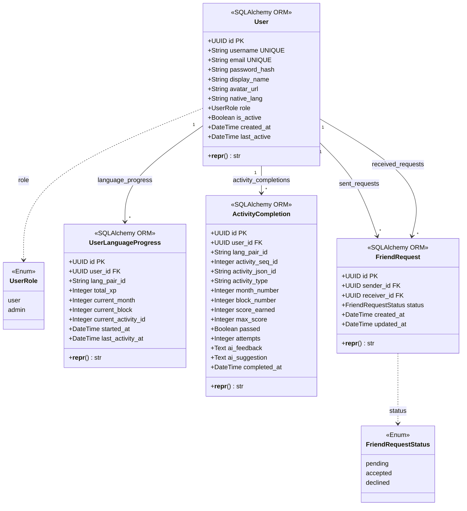
```mermaid
classDiagram
    direction TB

    class User {
        <<SQLAlchemy ORM>>
        +UUID id PK
        +String username UNIQUE
        +String email UNIQUE
        +String password_hash
        +String display_name
        +String avatar_url
        +String native_lang
        +UserRole role
        +Boolean is_active
        +DateTime created_at
        +DateTime last_active
        +__repr__() str
    }

    class UserRole {
        <<Enum>>
        user
        admin
    }

    class UserLanguageProgress {
        <<SQLAlchemy ORM>>
        +UUID id PK
        +UUID user_id FK
        +String lang_pair_id
        +Integer total_xp
        +Integer current_month
        +Integer current_block
        +Integer current_activity_id
        +DateTime started_at
        +DateTime last_activity_at
        +__repr__() str
    }

    class ActivityCompletion {
        <<SQLAlchemy ORM>>
        +UUID id PK
        +UUID user_id FK
        +String lang_pair_id
        +Integer activity_seq_id
        +String activity_json_id
        +String activity_type
        +Integer month_number
        +Integer block_number
        +Integer score_earned
        +Integer max_score
        +Boolean passed
        +Integer attempts
        +Text ai_feedback
        +Text ai_suggestion
        +DateTime completed_at
        +__repr__() str
    }

    class FriendRequest {
        <<SQLAlchemy ORM>>
        +UUID id PK
        +UUID sender_id FK
        +UUID receiver_id FK
        +FriendRequestStatus status
        +DateTime created_at
        +DateTime updated_at
        +__repr__() str
    }

    class FriendRequestStatus {
        <<Enum>>
        pending
        accepted
        declined
    }

    User "1" --> "*" UserLanguageProgress : language_progress
    User "1" --> "*" ActivityCompletion : activity_completions
    User "1" --> "*" FriendRequest : sent_requests
    User "1" --> "*" FriendRequest : received_requests
    User ..> UserRole : role
    FriendRequest ..> FriendRequestStatus : status
```

---

## 1.2 — Backend Core & Services Layer

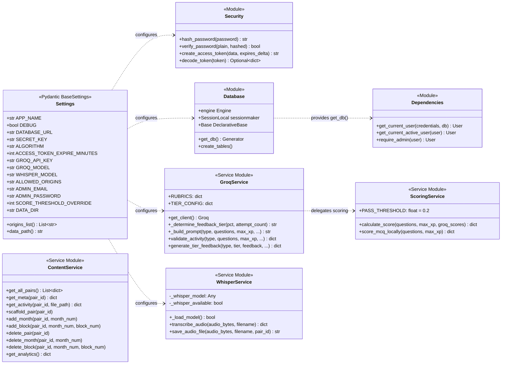
```mermaid
classDiagram
    direction LR

    class Settings {
        <<Pydantic BaseSettings>>
        +str APP_NAME
        +bool DEBUG
        +str DATABASE_URL
        +str SECRET_KEY
        +str ALGORITHM
        +int ACCESS_TOKEN_EXPIRE_MINUTES
        +str GROQ_API_KEY
        +str GROQ_MODEL
        +str WHISPER_MODEL
        +str ALLOWED_ORIGINS
        +str ADMIN_EMAIL
        +str ADMIN_PASSWORD
        +int SCORE_THRESHOLD_OVERRIDE
        +str DATA_DIR
        +origins_list() List~str~
        +data_path() str
    }

    class Security {
        <<Module>>
        +hash_password(password) str
        +verify_password(plain, hashed) bool
        +create_access_token(data, expires_delta) str
        +decode_token(token) Optional~dict~
    }

    class Dependencies {
        <<Module>>
        +get_current_user(credentials, db) User
        +get_current_active_user(user) User
        +require_admin(user) User
    }

    class Database {
        <<Module>>
        +engine Engine
        +SessionLocal sessionmaker
        +Base DeclarativeBase
        +get_db() Generator
        +create_tables()
    }

    class ScoringService {
        <<Service Module>>
        +PASS_THRESHOLD: float = 0.2
        +calculate_score(questions, max_xp, groq_scores) dict
        +score_mcq_locally(questions, max_xp) dict
    }

    class GroqService {
        <<Service Module>>
        +RUBRICS: dict
        +TIER_CONFIG: dict
        +get_client() Groq
        +_determine_feedback_tier(pct, attempt_count) str
        +_build_prompt(type, questions, max_xp, ...) str
        +validate_activity(type, questions, max_xp, ...) dict
        +generate_tier_feedback(type, tier, feedback, ...) dict
    }

    class WhisperService {
        <<Service Module>>
        -_whisper_model: Any
        -_whisper_available: bool
        +_load_model() bool
        +transcribe_audio(audio_bytes, filename) dict
        +save_audio_file(audio_bytes, filename, pair_id) str
    }

    class ContentService {
        <<Service Module>>
        +get_all_pairs() List~dict~
        +get_meta(pair_id) dict
        +get_activity(pair_id, file_path) dict
        +scaffold_pair(pair_id)
        +add_month(pair_id, month_num)
        +add_block(pair_id, month_num, block_num)
        +delete_pair(pair_id)
        +delete_month(pair_id, month_num)
        +delete_block(pair_id, month_num, block_num)
        +get_analytics() dict
    }

    Settings ..> Database : configures
    Settings ..> Security : configures
    Settings ..> GroqService : configures
    Settings ..> WhisperService : configures
    Database ..> Dependencies : provides get_db()
    GroqService ..> ScoringService : delegates scoring
```

---

## 1.3 — Backend API Routers Layer


```mermaid
classDiagram
    direction TB

    class AuthRouter {
        <<FastAPI Router>>
        +prefix: /api/auth
        +register(req) TokenResponse
        +login(req) TokenResponse
        +admin_login(req) TokenResponse
        +get_me(user) UserOut
    }

    class ProgressRouter {
        <<FastAPI Router>>
        +prefix: /api/progress
        +get_all_progress() List~ProgressOut~
        +get_pair_progress(pair_id) ProgressOut
        +start_pair(pair_id) ProgressOut
        +complete_activity(pair_id, req) CompletionOut
        +get_completions(pair_id) List~CompletionOut~
        -_derive_month_block(seq_id) tuple
    }

    class ValidateRouter {
        <<FastAPI Router>>
        +prefix: /api/validate
        +MCQ_TYPES: set
        +GROQ_TYPES: set
        +validate_activity(req) ValidateResponse
    }

    class SpeechRouter {
        <<FastAPI Router>>
        +prefix: /api/speech
        +MAX_AUDIO_SIZE: int
        +MIN_AUDIO_SIZE: int
        +transcribe(audio) TranscribeResponse
        -_is_allowed_audio(content_type) bool
    }

    class LeaderboardRouter {
        <<FastAPI Router>>
        +prefix: /api/leaderboard
        +get_leaderboard(pair_id, limit) List~LeaderboardEntry~
        +get_friends_leaderboard(pair_id) List~LeaderboardEntry~
    }

    class FriendsRouter {
        <<FastAPI Router>>
        +prefix: /api/friends
        +get_friends() dict
        +get_incoming_requests() dict
        +send_request(user_id) dict
        +accept_request(req_id) dict
        +decline_request(req_id) dict
        +remove_friend(user_id) dict
    }

    class UsersRouter {
        <<FastAPI Router>>
        +prefix: /api/users
        +get_my_profile() UserProfileOut
        +update_profile(req) UserProfileOut
        +search_users(q, limit) UserSearchResult
        +get_user_profile(user_id) UserPublicOut
        +get_user_progress_public(user_id) dict
    }

    class AdminRouter {
        <<FastAPI Router>>
        +prefix: /api/admin
        +auth: require_admin dependency
        +get_all_users() List~UserOut~
        +activate_user(user_id) dict
        +deactivate_user(user_id) dict
        +get_analytics() dict
        +create_pair(pair_id) dict
        +delete_pair(pair_id) dict
        +add_month(pair_id, month_num) dict
        +add_block(pair_id, month_num, block_num) dict
        +update_activity(pair_id, ...) dict
        +get_admin_stats() dict
    }

    ValidateRouter ..> GroqService : delegates
    ValidateRouter ..> ScoringService : delegates
    SpeechRouter ..> WhisperService : delegates
    AdminRouter ..> ContentService : delegates
    ProgressRouter ..> UserLanguageProgress : reads/writes
    ProgressRouter ..> ActivityCompletion : reads/writes
```

---

## 1.4 — Frontend Redux Store & API Client Layer

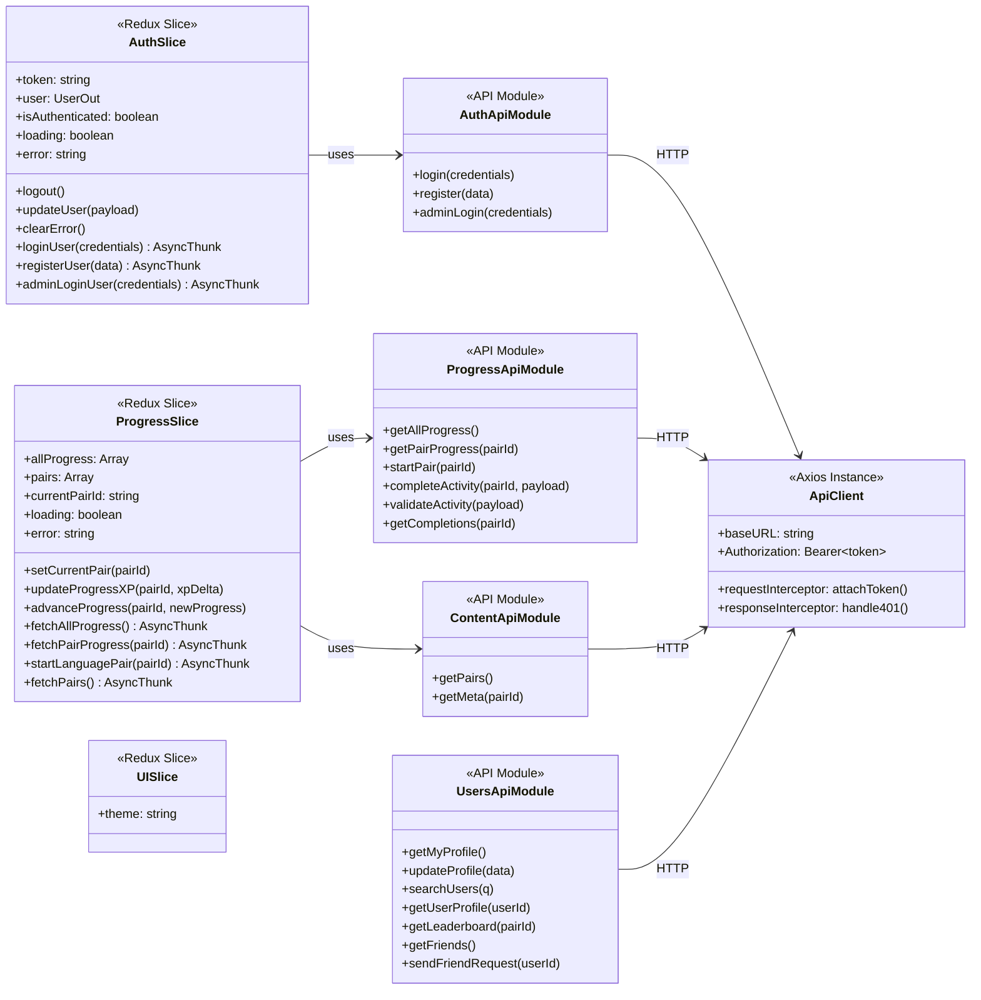
```mermaid
classDiagram
    direction LR

    class AuthSlice {
        <<Redux Slice>>
        +token: string
        +user: UserOut
        +isAuthenticated: boolean
        +loading: boolean
        +error: string
        +logout()
        +updateUser(payload)
        +clearError()
        +loginUser(credentials) AsyncThunk
        +registerUser(data) AsyncThunk
        +adminLoginUser(credentials) AsyncThunk
    }

    class ProgressSlice {
        <<Redux Slice>>
        +allProgress: Array
        +pairs: Array
        +currentPairId: string
        +loading: boolean
        +error: string
        +setCurrentPair(pairId)
        +updateProgressXP(pairId, xpDelta)
        +advanceProgress(pairId, newProgress)
        +fetchAllProgress() AsyncThunk
        +fetchPairProgress(pairId) AsyncThunk
        +startLanguagePair(pairId) AsyncThunk
        +fetchPairs() AsyncThunk
    }

    class UISlice {
        <<Redux Slice>>
        +theme: string
    }

    class ApiClient {
        <<Axios Instance>>
        +baseURL: string
        +Authorization: Bearer~token~
        +requestInterceptor: attachToken()
        +responseInterceptor: handle401()
    }

    class AuthApiModule {
        <<API Module>>
        +login(credentials)
        +register(data)
        +adminLogin(credentials)
    }

    class ProgressApiModule {
        <<API Module>>
        +getAllProgress()
        +getPairProgress(pairId)
        +startPair(pairId)
        +completeActivity(pairId, payload)
        +validateActivity(payload)
        +getCompletions(pairId)
    }

    class ContentApiModule {
        <<API Module>>
        +getPairs()
        +getMeta(pairId)
    }

    class UsersApiModule {
        <<API Module>>
        +getMyProfile()
        +updateProfile(data)
        +searchUsers(q)
        +getUserProfile(userId)
        +getLeaderboard(pairId)
        +getFriends()
        +sendFriendRequest(userId)
    }

    AuthSlice --> AuthApiModule : uses
    ProgressSlice --> ProgressApiModule : uses
    ProgressSlice --> ContentApiModule : uses
    AuthApiModule --> ApiClient : HTTP
    ProgressApiModule --> ApiClient : HTTP
    ContentApiModule --> ApiClient : HTTP
    UsersApiModule --> ApiClient : HTTP
```

---

## 1.5 — Frontend Pages & Components Layer

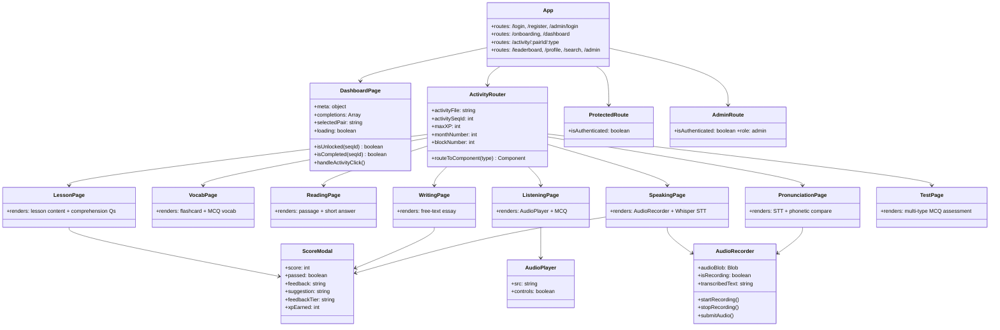
```mermaid
classDiagram
    direction TB

    class App {
        +routes: /login, /register, /admin/login
        +routes: /onboarding, /dashboard
        +routes: /activity/:pairId/:type
        +routes: /leaderboard, /profile, /search, /admin
    }

    class DashboardPage {
        +meta: object
        +completions: Array
        +selectedPair: string
        +loading: boolean
        +isUnlocked(seqId) boolean
        +isCompleted(seqId) boolean
        +handleActivityClick()
    }

    class ActivityRouter {
        +activityFile: string
        +activitySeqId: int
        +maxXP: int
        +monthNumber: int
        +blockNumber: int
        +routeToComponent(type) Component
    }

    class LessonPage { +renders: lesson content + comprehension Qs }
    class VocabPage { +renders: flashcard + MCQ vocab }
    class ReadingPage { +renders: passage + short answer }
    class WritingPage { +renders: free-text essay }
    class ListeningPage { +renders: AudioPlayer + MCQ }
    class SpeakingPage { +renders: AudioRecorder + Whisper STT }
    class PronunciationPage { +renders: STT + phonetic compare }
    class TestPage { +renders: multi-type MCQ assessment }

    class ScoreModal {
        +score: int
        +passed: boolean
        +feedback: string
        +suggestion: string
        +feedbackTier: string
        +xpEarned: int
    }

    class AudioRecorder {
        +audioBlob: Blob
        +isRecording: boolean
        +transcribedText: string
        +startRecording()
        +stopRecording()
        +submitAudio()
    }

    class AudioPlayer {
        +src: string
        +controls: boolean
    }

    class ProtectedRoute { +isAuthenticated: boolean }
    class AdminRoute { +isAuthenticated: boolean +role: admin }

    App --> DashboardPage
    App --> ActivityRouter
    App --> ProtectedRoute
    App --> AdminRoute
    ActivityRouter --> LessonPage
    ActivityRouter --> VocabPage
    ActivityRouter --> ReadingPage
    ActivityRouter --> WritingPage
    ActivityRouter --> ListeningPage
    ActivityRouter --> SpeakingPage
    ActivityRouter --> PronunciationPage
    ActivityRouter --> TestPage
    SpeakingPage --> AudioRecorder
    PronunciationPage --> AudioRecorder
    ListeningPage --> AudioPlayer
    LessonPage --> ScoreModal
    WritingPage --> ScoreModal
    SpeakingPage --> ScoreModal
```

---

# SECTION 2: SEQUENCE DIAGRAMS

> **Notation:** Messages flow top-to-bottom representing time. `alt` blocks show conditional branches. `par` shows parallel operations.

---

## 2.1 — User Registration Flow

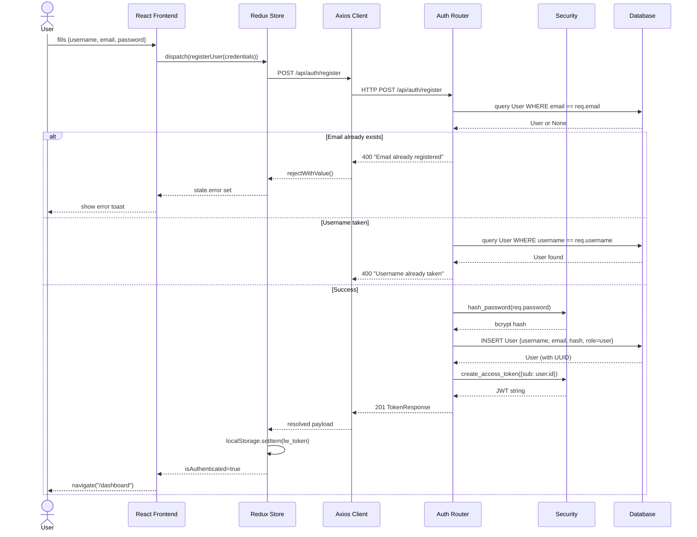
```mermaid
sequenceDiagram
    actor User
    participant React as React Frontend
    participant Redux as Redux Store
    participant Axios as Axios Client
    participant Auth as Auth Router
    participant Sec as Security
    participant DB as Database

    User->>React: fills {username, email, password}
    React->>Redux: dispatch(registerUser(credentials))
    Redux->>Axios: POST /api/auth/register
    Axios->>Auth: HTTP POST /api/auth/register

    Auth->>DB: query User WHERE email == req.email
    DB-->>Auth: User or None

    alt Email already exists
        Auth-->>Axios: 400 "Email already registered"
        Axios-->>Redux: rejectWithValue()
        Redux-->>React: state.error set
        React-->>User: show error toast
    else Username taken
        Auth->>DB: query User WHERE username == req.username
        DB-->>Auth: User found
        Auth-->>Axios: 400 "Username already taken"
    else Success
        Auth->>Sec: hash_password(req.password)
        Sec-->>Auth: bcrypt hash
        Auth->>DB: INSERT User {username, email, hash, role=user}
        DB-->>Auth: User (with UUID)
        Auth->>Sec: create_access_token({sub: user.id})
        Sec-->>Auth: JWT string
        Auth-->>Axios: 201 TokenResponse
        Axios-->>Redux: resolved payload
        Redux->>Redux: localStorage.setItem(lw_token)
        Redux-->>React: isAuthenticated=true
        React-->>User: navigate("/dashboard")
    end
```

---

## 2.2 — User Login Flow

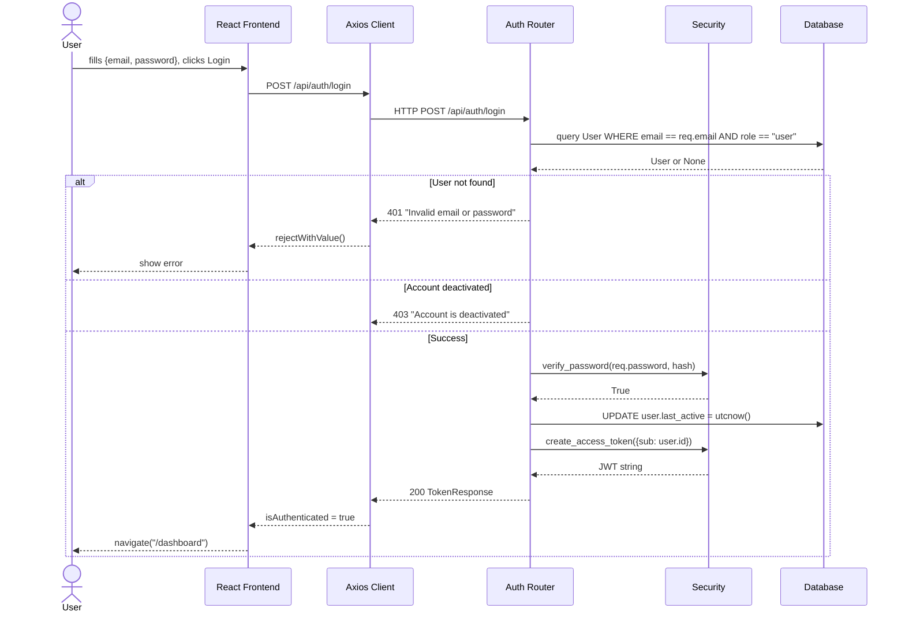
```mermaid
sequenceDiagram
    actor User
    participant React as React Frontend
    participant Axios as Axios Client
    participant Auth as Auth Router
    participant Sec as Security
    participant DB as Database

    User->>React: fills {email, password}, clicks Login
    React->>Axios: POST /api/auth/login
    Axios->>Auth: HTTP POST /api/auth/login

    Auth->>DB: query User WHERE email == req.email AND role == "user"
    DB-->>Auth: User or None

    alt User not found
        Auth-->>Axios: 401 "Invalid email or password"
        Axios-->>React: rejectWithValue()
        React-->>User: show error
    else Account deactivated
        Auth-->>Axios: 403 "Account is deactivated"
    else Success
        Auth->>Sec: verify_password(req.password, hash)
        Sec-->>Auth: True
        Auth->>DB: UPDATE user.last_active = utcnow()
        Auth->>Sec: create_access_token({sub: user.id})
        Sec-->>Auth: JWT string
        Auth-->>Axios: 200 TokenResponse
        Axios-->>React: isAuthenticated = true
        React-->>User: navigate("/dashboard")
    end
```

---

## 2.3 — JWT Authentication on Every Protected Request

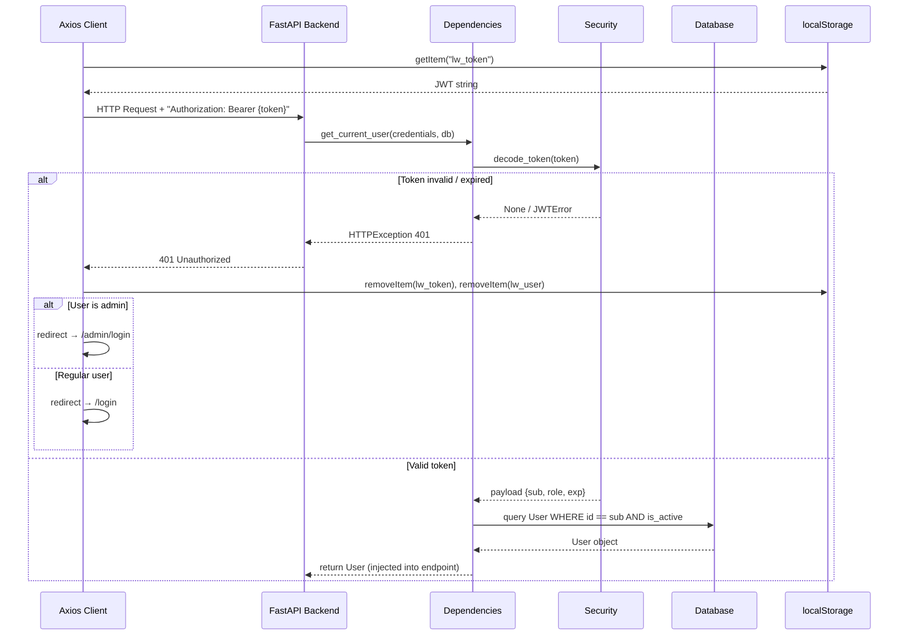
```mermaid
sequenceDiagram
    participant Axios as Axios Client
    participant Backend as FastAPI Backend
    participant Dep as Dependencies
    participant Sec as Security
    participant DB as Database
    participant LS as localStorage

    Axios->>LS: getItem("lw_token")
    LS-->>Axios: JWT string
    Axios->>Backend: HTTP Request + "Authorization: Bearer {token}"
    Backend->>Dep: get_current_user(credentials, db)
    Dep->>Sec: decode_token(token)

    alt Token invalid / expired
        Sec-->>Dep: None / JWTError
        Dep-->>Backend: HTTPException 401
        Backend-->>Axios: 401 Unauthorized
        Axios->>LS: removeItem(lw_token), removeItem(lw_user)
        alt User is admin
            Axios->>Axios: redirect → /admin/login
        else Regular user
            Axios->>Axios: redirect → /login
        end
    else Valid token
        Sec-->>Dep: payload {sub, role, exp}
        Dep->>DB: query User WHERE id == sub AND is_active
        DB-->>Dep: User object
        Dep-->>Backend: return User (injected into endpoint)
    end
```

---

## 2.4 — Dashboard Load (Parallel Fetches)

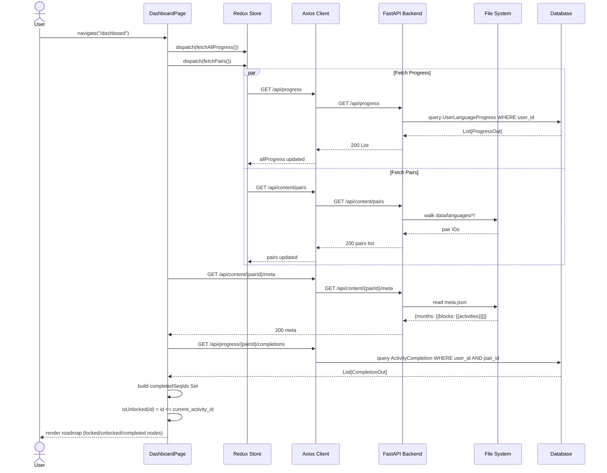
```mermaid
sequenceDiagram
    actor User
    participant Dash as DashboardPage
    participant Redux as Redux Store
    participant Axios as Axios Client
    participant Back as FastAPI Backend
    participant FS as File System
    participant DB as Database

    User->>Dash: navigate("/dashboard")
    Dash->>Redux: dispatch(fetchAllProgress())
    Dash->>Redux: dispatch(fetchPairs())

    par Fetch Progress
        Redux->>Axios: GET /api/progress
        Axios->>Back: GET /api/progress
        Back->>DB: query UserLanguageProgress WHERE user_id
        DB-->>Back: List[ProgressOut]
        Back-->>Axios: 200 List
        Axios-->>Redux: allProgress updated
    and Fetch Pairs
        Redux->>Axios: GET /api/content/pairs
        Axios->>Back: GET /api/content/pairs
        Back->>FS: walk data/languages/*/
        FS-->>Back: pair IDs
        Back-->>Axios: 200 pairs list
        Axios-->>Redux: pairs updated
    end

    Dash->>Axios: GET /api/content/{pairId}/meta
    Axios->>Back: GET /api/content/{pairId}/meta
    Back->>FS: read meta.json
    FS-->>Back: {months: [{blocks: [{activities}]}]}
    Back-->>Dash: 200 meta

    Dash->>Axios: GET /api/progress/{pairId}/completions
    Axios->>DB: query ActivityCompletion WHERE user_id AND pair_id
    DB-->>Dash: List[CompletionOut]

    Dash->>Dash: build completedSeqIds Set
    Dash->>Dash: isUnlocked(id) = id <= current_activity_id
    Dash-->>User: render roadmap (locked/unlocked/completed nodes)
```

---

## 2.5 — Activity Submission & AI Grading (Groq Path)

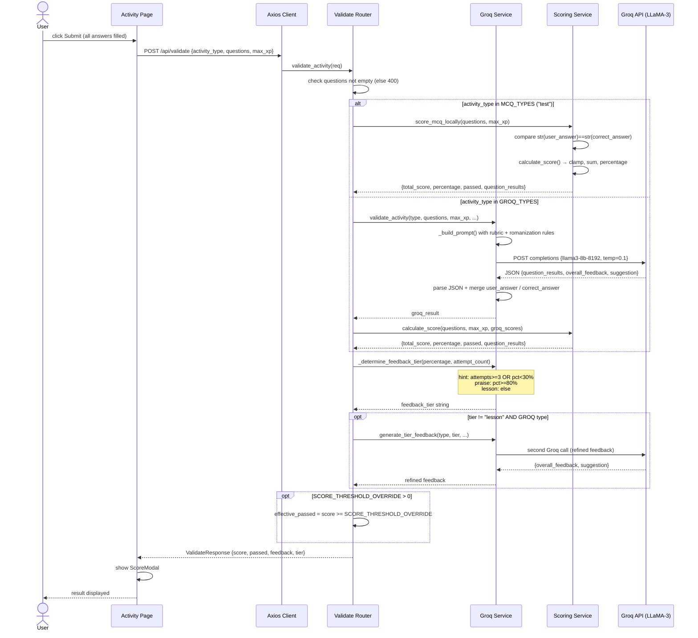
```mermaid
sequenceDiagram
    actor User
    participant Page as Activity Page
    participant Axios as Axios Client
    participant Val as Validate Router
    participant Groq as Groq Service
    participant Scoring as Scoring Service
    participant AI as Groq API (LLaMA-3)

    User->>Page: click Submit (all answers filled)
    Page->>Axios: POST /api/validate {activity_type, questions, max_xp}
    Axios->>Val: validate_activity(req)

    Val->>Val: check questions not empty (else 400)

    alt activity_type in MCQ_TYPES ("test")
        Val->>Scoring: score_mcq_locally(questions, max_xp)
        Scoring->>Scoring: compare str(user_answer)==str(correct_answer)
        Scoring->>Scoring: calculate_score() → clamp, sum, percentage
        Scoring-->>Val: {total_score, percentage, passed, question_results}
    else activity_type in GROQ_TYPES
        Val->>Groq: validate_activity(type, questions, max_xp, ...)
        Groq->>Groq: _build_prompt() with rubric + romanization rules
        Groq->>AI: POST completions {llama3-8b-8192, temp=0.1}
        AI-->>Groq: JSON {question_results, overall_feedback, suggestion}
        Groq->>Groq: parse JSON + merge user_answer / correct_answer
        Groq-->>Val: groq_result

        Val->>Scoring: calculate_score(questions, max_xp, groq_scores)
        Scoring-->>Val: {total_score, percentage, passed, question_results}
    end

    Val->>Groq: _determine_feedback_tier(percentage, attempt_count)
    Note over Groq: hint: attempts>=3 OR pct<30%<br/>praise: pct>=80%<br/>lesson: else

    Groq-->>Val: feedback_tier string

    opt tier != "lesson" AND GROQ type
        Val->>Groq: generate_tier_feedback(type, tier, ...)
        Groq->>AI: second Groq call (refined feedback)
        AI-->>Groq: {overall_feedback, suggestion}
        Groq-->>Val: refined feedback
    end

    opt SCORE_THRESHOLD_OVERRIDE > 0
        Val->>Val: effective_passed = score >= SCORE_THRESHOLD_OVERRIDE
    end

    Val-->>Page: ValidateResponse {score, passed, feedback, tier}
    Page->>Page: show ScoreModal
    Page-->>User: result displayed
```

---

## 2.6 — Activity Completion Recording & Progression Unlock

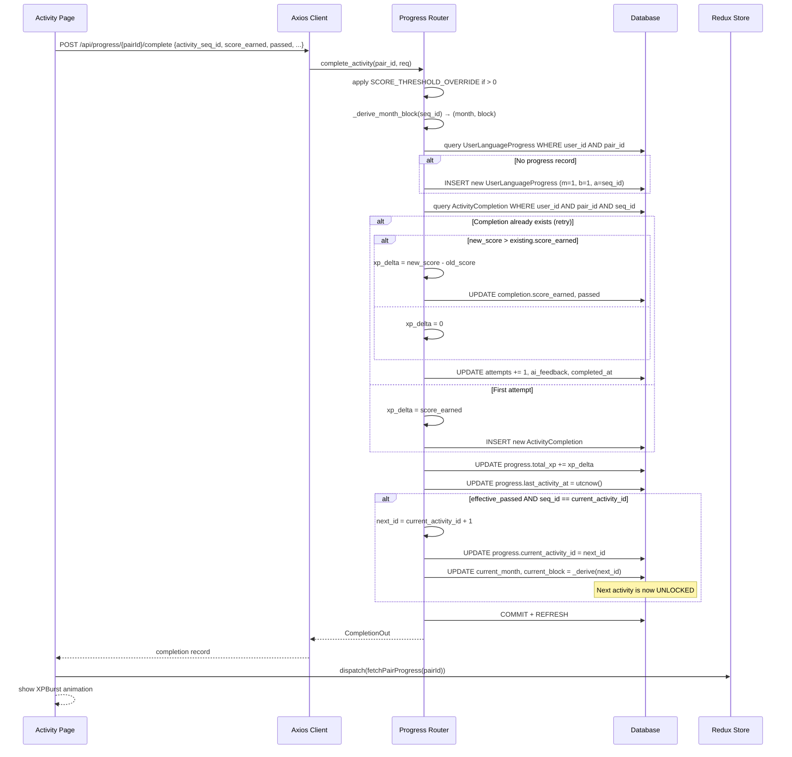
```mermaid
sequenceDiagram
    participant Page as Activity Page
    participant Axios as Axios Client
    participant Prog as Progress Router
    participant DB as Database
    participant Redux as Redux Store

    Page->>Axios: POST /api/progress/{pairId}/complete {activity_seq_id, score_earned, passed, ...}
    Axios->>Prog: complete_activity(pair_id, req)

    Prog->>Prog: apply SCORE_THRESHOLD_OVERRIDE if > 0
    Prog->>Prog: _derive_month_block(seq_id) → (month, block)

    Prog->>DB: query UserLanguageProgress WHERE user_id AND pair_id
    alt No progress record
        Prog->>DB: INSERT new UserLanguageProgress (m=1, b=1, a=seq_id)
    end

    Prog->>DB: query ActivityCompletion WHERE user_id AND pair_id AND seq_id

    alt Completion already exists (retry)
        alt new_score > existing.score_earned
            Prog->>Prog: xp_delta = new_score - old_score
            Prog->>DB: UPDATE completion.score_earned, passed
        else
            Prog->>Prog: xp_delta = 0
        end
        Prog->>DB: UPDATE attempts += 1, ai_feedback, completed_at
    else First attempt
        Prog->>Prog: xp_delta = score_earned
        Prog->>DB: INSERT new ActivityCompletion
    end

    Prog->>DB: UPDATE progress.total_xp += xp_delta
    Prog->>DB: UPDATE progress.last_activity_at = utcnow()

    alt effective_passed AND seq_id == current_activity_id
        Prog->>Prog: next_id = current_activity_id + 1
        Prog->>DB: UPDATE progress.current_activity_id = next_id
        Prog->>DB: UPDATE current_month, current_block = _derive(next_id)
        Note over DB: Next activity is now UNLOCKED
    end

    Prog->>DB: COMMIT + REFRESH
    Prog-->>Axios: CompletionOut
    Axios-->>Page: completion record
    Page->>Redux: dispatch(fetchPairProgress(pairId))
    Page-->>Page: show XPBurst animation
```

---

## 2.7 — Speech Transcription (Whisper STT)

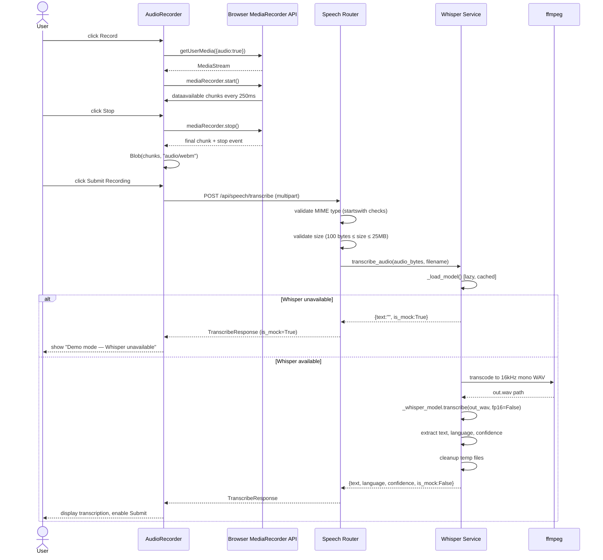
```mermaid
sequenceDiagram
    actor User
    participant Rec as AudioRecorder
    participant Browser as Browser MediaRecorder API
    participant Speech as Speech Router
    participant Whisper as Whisper Service
    participant ffmpeg as ffmpeg

    User->>Rec: click Record
    Rec->>Browser: getUserMedia({audio:true})
    Browser-->>Rec: MediaStream
    Rec->>Browser: mediaRecorder.start()
    Browser->>Rec: dataavailable chunks every 250ms

    User->>Rec: click Stop
    Rec->>Browser: mediaRecorder.stop()
    Browser-->>Rec: final chunk + stop event
    Rec->>Rec: Blob(chunks, "audio/webm")

    User->>Rec: click Submit Recording
    Rec->>Speech: POST /api/speech/transcribe (multipart)

    Speech->>Speech: validate MIME type (startswith checks)
    Speech->>Speech: validate size (100 bytes ≤ size ≤ 25MB)

    Speech->>Whisper: transcribe_audio(audio_bytes, filename)
    Whisper->>Whisper: _load_model() [lazy, cached]

    alt Whisper unavailable
        Whisper-->>Speech: {text:"", is_mock:True}
        Speech-->>Rec: TranscribeResponse (is_mock=True)
        Rec-->>User: show "Demo mode — Whisper unavailable"
    else Whisper available
        Whisper->>ffmpeg: transcode to 16kHz mono WAV
        ffmpeg-->>Whisper: out.wav path
        Whisper->>Whisper: _whisper_model.transcribe(out_wav, fp16=False)
        Whisper->>Whisper: extract text, language, confidence
        Whisper->>Whisper: cleanup temp files
        Whisper-->>Speech: {text, language, confidence, is_mock:False}
        Speech-->>Rec: TranscribeResponse
        Rec-->>User: display transcription, enable Submit
    end
```

---

## 2.8 — Friend Request Lifecycle

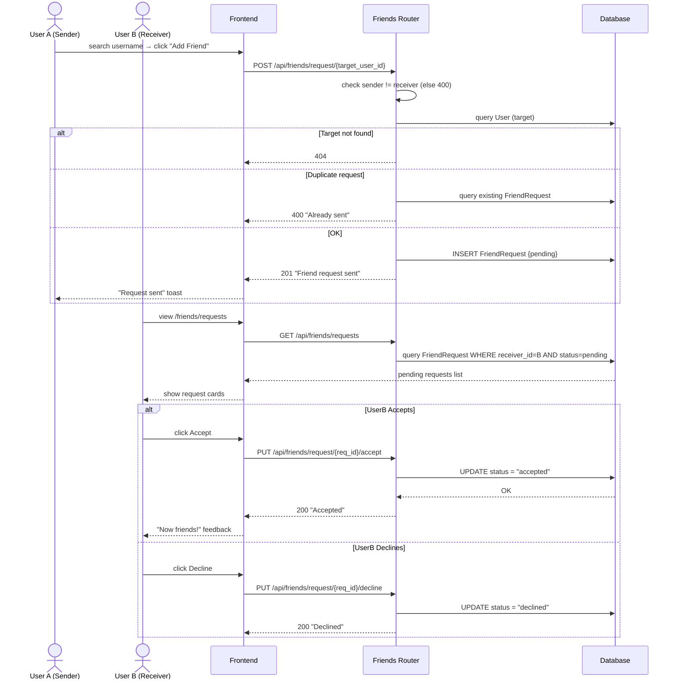
```mermaid
sequenceDiagram
    actor UserA as User A (Sender)
    actor UserB as User B (Receiver)
    participant React as Frontend
    participant Friends as Friends Router
    participant DB as Database

    UserA->>React: search username → click "Add Friend"
    React->>Friends: POST /api/friends/request/{target_user_id}
    Friends->>Friends: check sender != receiver (else 400)
    Friends->>DB: query User (target)
    alt Target not found
        Friends-->>React: 404
    else Duplicate request
        Friends->>DB: query existing FriendRequest
        Friends-->>React: 400 "Already sent"
    else OK
        Friends->>DB: INSERT FriendRequest {pending}
        Friends-->>React: 201 "Friend request sent"
        React-->>UserA: "Request sent" toast
    end

    UserB->>React: view /friends/requests
    React->>Friends: GET /api/friends/requests
    Friends->>DB: query FriendRequest WHERE receiver_id=B AND status=pending
    DB-->>React: pending requests list
    React-->>UserB: show request cards

    alt UserB Accepts
        UserB->>React: click Accept
        React->>Friends: PUT /api/friends/request/{req_id}/accept
        Friends->>DB: UPDATE status = "accepted"
        DB-->>Friends: OK
        Friends-->>React: 200 "Accepted"
        React-->>UserB: "Now friends!" feedback
    else UserB Declines
        UserB->>React: click Decline
        React->>Friends: PUT /api/friends/request/{req_id}/decline
        Friends->>DB: UPDATE status = "declined"
        Friends-->>React: 200 "Declined"
    end
```

---

## 2.9 — Leaderboard Load

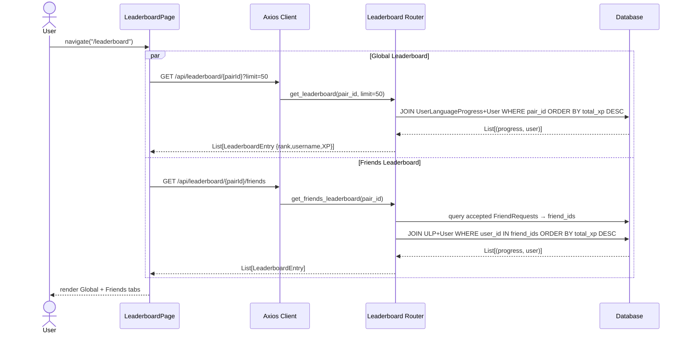
```mermaid
sequenceDiagram
    actor User
    participant LB as LeaderboardPage
    participant Axios as Axios Client
    participant Leader as Leaderboard Router
    participant DB as Database

    User->>LB: navigate("/leaderboard")

    par Global Leaderboard
        LB->>Axios: GET /api/leaderboard/{pairId}?limit=50
        Axios->>Leader: get_leaderboard(pair_id, limit=50)
        Leader->>DB: JOIN UserLanguageProgress+User WHERE pair_id ORDER BY total_xp DESC
        DB-->>Leader: List[(progress, user)]
        Leader-->>LB: List[LeaderboardEntry {rank,username,XP}]
    and Friends Leaderboard
        LB->>Axios: GET /api/leaderboard/{pairId}/friends
        Axios->>Leader: get_friends_leaderboard(pair_id)
        Leader->>DB: query accepted FriendRequests → friend_ids
        Leader->>DB: JOIN ULP+User WHERE user_id IN friend_ids ORDER BY total_xp DESC
        DB-->>Leader: List[(progress, user)]
        Leader-->>LB: List[LeaderboardEntry]
    end

    LB-->>User: render Global + Friends tabs
```

---

## 2.10 — Admin: Create Language Pair

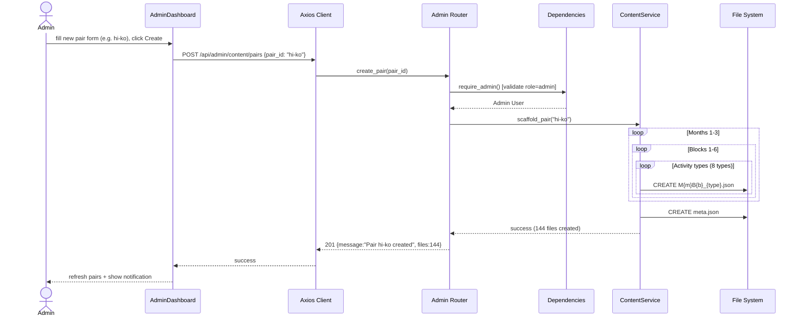
```mermaid
sequenceDiagram
    actor Admin
    participant Dash as AdminDashboard
    participant Axios as Axios Client
    participant AdminR as Admin Router
    participant Dep as Dependencies
    participant CS as ContentService
    participant FS as File System

    Admin->>Dash: fill new pair form (e.g. hi-ko), click Create
    Dash->>Axios: POST /api/admin/content/pairs {pair_id: "hi-ko"}
    Axios->>AdminR: create_pair(pair_id)
    AdminR->>Dep: require_admin() [validate role=admin]
    Dep-->>AdminR: Admin User

    AdminR->>CS: scaffold_pair("hi-ko")
    loop Months 1-3
        loop Blocks 1-6
            loop Activity types (8 types)
                CS->>FS: CREATE M{m}B{b}_{type}.json
            end
        end
    end
    CS->>FS: CREATE meta.json
    CS-->>AdminR: success (144 files created)

    AdminR-->>Axios: 201 {message:"Pair hi-ko created", files:144}
    Axios-->>Dash: success
    Dash-->>Admin: refresh pairs + show notification
```

---

## 2.11 — Server Startup Initialization

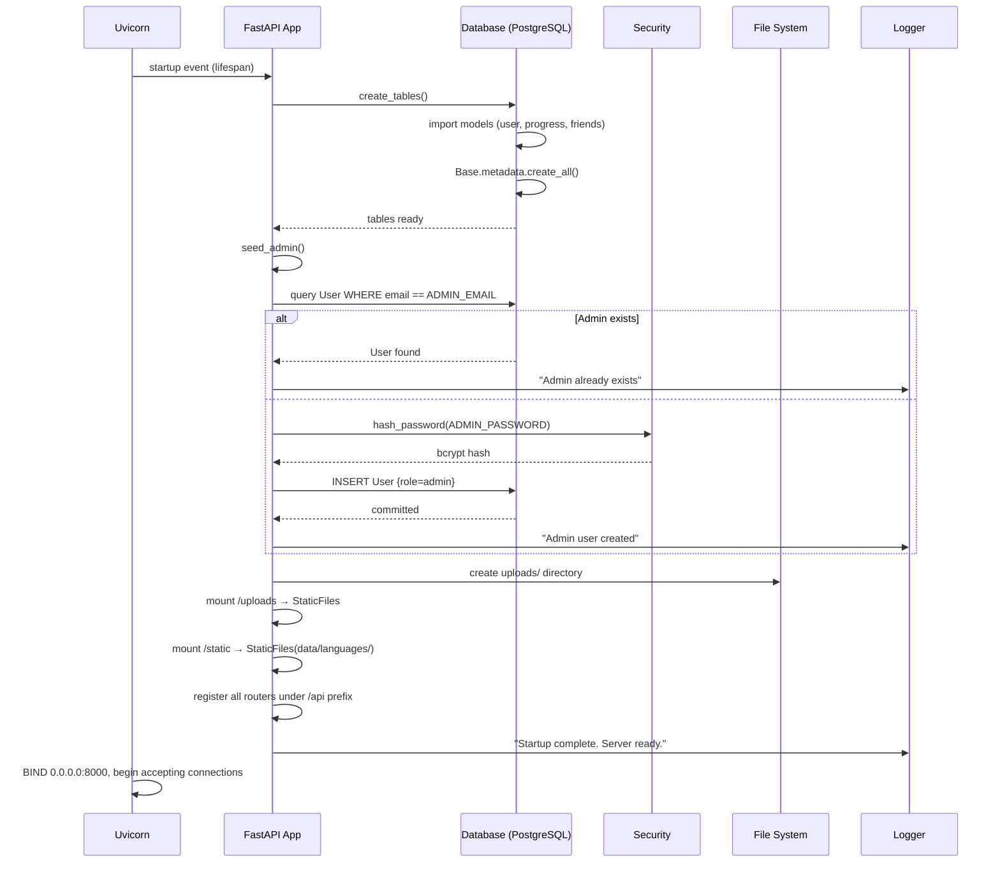
```mermaid
sequenceDiagram
    participant Uvi as Uvicorn
    participant App as FastAPI App
    participant DB as Database (PostgreSQL)
    participant Sec as Security
    participant FS as File System
    participant Log as Logger

    Uvi->>App: startup event (lifespan)
    App->>DB: create_tables()
    DB->>DB: import models (user, progress, friends)
    DB->>DB: Base.metadata.create_all()
    DB-->>App: tables ready

    App->>App: seed_admin()
    App->>DB: query User WHERE email == ADMIN_EMAIL
    alt Admin exists
        DB-->>App: User found
        App->>Log: "Admin already exists"
    else
        App->>Sec: hash_password(ADMIN_PASSWORD)
        Sec-->>App: bcrypt hash
        App->>DB: INSERT User {role=admin}
        DB-->>App: committed
        App->>Log: "Admin user created"
    end

    App->>FS: create uploads/ directory
    App->>App: mount /uploads → StaticFiles
    App->>App: mount /static → StaticFiles(data/languages/)
    App->>App: register all routers under /api prefix
    App->>Log: "Startup complete. Server ready."
    Uvi->>Uvi: BIND 0.0.0.0:8000, begin accepting connections
```

---

# SECTION 3: ACTIVITY DIAGRAMS

> **Notation:** Swimlanes show responsibility. `[Decision]` nodes are diamonds. `fork/join` shows parallel flows. `END` terminates the flow.

---

## 3.1 — User Registration Flow

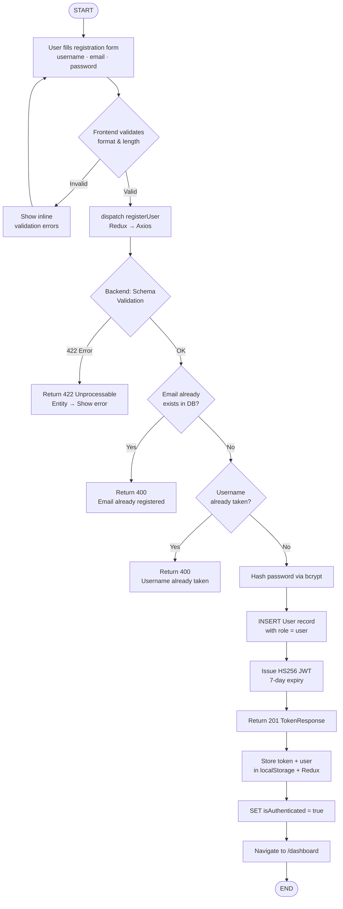
```mermaid
flowchart TD
    A([START]) --> B[User fills registration form\nusername · email · password]
    B --> C{Frontend validates\nformat & length}
    C -- Invalid --> D[Show inline\nvalidation errors]
    D --> B
    C -- Valid --> E[dispatch registerUser\nRedux → Axios]
    E --> F{Backend: Schema\nValidation}
    F -- 422 Error --> G[Return 422 Unprocessable\nEntity → Show error]
    F -- OK --> H{Email already\nexists in DB?}
    H -- Yes --> I[Return 400\nEmail already registered]
    H -- No --> J{Username\nalready taken?}
    J -- Yes --> K[Return 400\nUsername already taken]
    J -- No --> L[Hash password via bcrypt]
    L --> M[INSERT User record\nwith role = user]
    M --> N[Issue HS256 JWT\n7-day expiry]
    N --> O[Return 201 TokenResponse]
    O --> P[Store token + user\nin localStorage + Redux]
    P --> Q[SET isAuthenticated = true]
    Q --> R[Navigate to /dashboard]
    R --> Z([END])
```

---

## 3.2 — Dashboard Load and Render

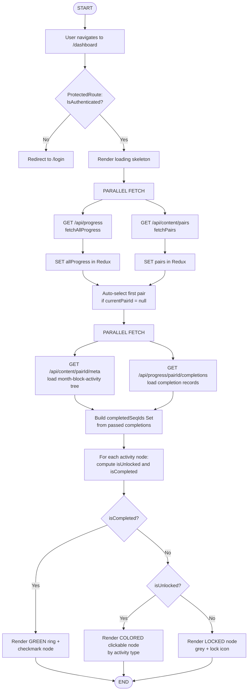
```mermaid
flowchart TD
    A([START]) --> B[User navigates to /dashboard]
    B --> C{ProtectedRoute:\nIsAuthenticated?}
    C -- No --> D[Redirect to /login]
    C -- Yes --> E[Render loading skeleton]

    E --> F[PARALLEL FETCH]
    F --> G[GET /api/progress\nfetchAllProgress]
    F --> H[GET /api/content/pairs\nfetchPairs]
    G --> I[SET allProgress in Redux]
    H --> J[SET pairs in Redux]

    I --> K[Auto-select first pair\nif currentPairId = null]
    J --> K

    K --> L[PARALLEL FETCH]
    L --> M[GET /api/content/pairId/meta\nload month-block-activity tree]
    L --> N[GET /api/progress/pairId/completions\nload completion records]

    M --> O[Build completedSeqIds Set\nfrom passed completions]
    N --> O

    O --> P[For each activity node:\ncompute isUnlocked and isCompleted]
    P --> Q{isCompleted?}
    Q -- Yes --> R[Render GREEN ring +\ncheckmark node]
    Q -- No --> S{isUnlocked?}
    S -- Yes --> T[Render COLORED clickable node\nby activity type]
    S -- No --> U[Render LOCKED node\ngrey + lock icon]
    R --> V([END])
    T --> V
    U --> V
```

---

## 3.3 — Activity Execution General Flow

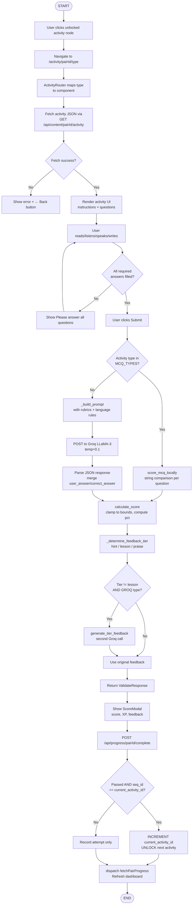
```mermaid
flowchart TD
    A([START]) --> B[User clicks unlocked activity node]
    B --> C[Navigate to /activity/pairId/type]
    C --> D[ActivityRouter maps type\nto component]
    D --> E[Fetch activity JSON via\nGET /api/content/pairId/activity]
    E --> F{Fetch success?}
    F -- No --> G[Show error + ← Back button]
    F -- Yes --> H[Render activity UI\ninstructions + questions]

    H --> I[User reads/listens/speaks/writes]
    I --> J{All required\nanswers filled?}
    J -- No --> K[Show Please answer all questions]
    K --> I
    J -- Yes --> L[User clicks Submit]

    L --> M{Activity type in\nMCQ_TYPES?}
    M -- Yes --> N[score_mcq_locally\nstring comparison per question]
    M -- No --> O[_build_prompt\nwith rubrics + language rules]
    O --> P[POST to Groq LLaMA-3\ntemp=0.1]
    P --> Q[Parse JSON response\nmerge user_answer/correct_answer]

    N --> R[calculate_score\nclamp to bounds, compute pct]
    Q --> R

    R --> S[_determine_feedback_tier\nhint / lesson / praise]
    S --> T{Tier != lesson\nAND GROQ type?}
    T -- Yes --> U[generate_tier_feedback\nsecond Groq call]
    T -- No --> V[Use original feedback]
    U --> V

    V --> W[Return ValidateResponse]
    W --> X[Show ScoreModal\nscore, XP, feedback]
    X --> Y[POST /api/progress/pairId/complete]
    Y --> Z{Passed AND seq_id\n== current_activity_id?}
    Z -- Yes --> AA[INCREMENT current_activity_id\nUNLOCK next activity]
    Z -- No --> AB[Record attempt only]
    AA --> AC[dispatch fetchPairProgress\nRefresh dashboard]
    AB --> AC
    AC --> AD([END])
```

---

## 3.4 — STT Recording Flow (Speaking / Pronunciation)

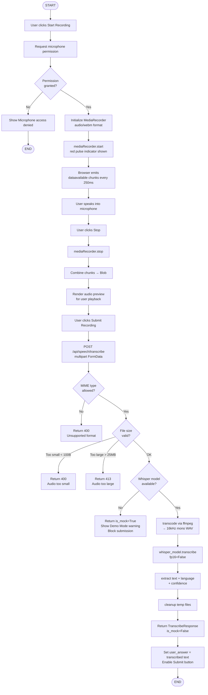
```mermaid
flowchart TD
    A([START]) --> B[User clicks Start Recording]
    B --> C[Request microphone permission]
    C --> D{Permission\ngranted?}
    D -- No --> E[Show Microphone access denied]
    E --> Z([END])
    D -- Yes --> F[Initialize MediaRecorder\naudio/webm format]
    F --> G[mediaRecorder.start\nred pulse indicator shown]
    G --> H[Browser emits\ndataavailable chunks every 250ms]
    H --> I[User speaks into microphone]
    I --> J[User clicks Stop]
    J --> K[mediaRecorder.stop]
    K --> L[Combine chunks → Blob]
    L --> M[Render audio preview\nfor user playback]

    M --> N[User clicks Submit Recording]
    N --> O[POST /api/speech/transcribe\nmultipart FormData]
    O --> P{MIME type\nallowed?}
    P -- No --> Q[Return 400\nUnsupported format]
    P -- Yes --> R{File size\nvalid?}
    R -- Too small < 100B --> S[Return 400\nAudio too small]
    R -- Too large > 25MB --> T[Return 413\nAudio too large]
    R -- OK --> U{Whisper model\navailable?}

    U -- No --> V[Return is_mock=True\nShow Demo Mode warning\nBlock submission]
    U -- Yes --> W[transcode via ffmpeg\n→ 16kHz mono WAV]
    W --> X[whisper_model.transcribe\nfp16=False]
    X --> Y[extract text + language\n+ confidence]
    Y --> YY[cleanup temp files]
    YY --> ZZ[Return TranscribeResponse\nis_mock=False]
    ZZ --> AAA[Set user_answer = transcribed text\nEnable Submit button]
    AAA --> BBB([END])
```

---

## 3.5 — Friend Request System Flow

```mermaid
flowchart TD
    A([START]) --> B[User A navigates to /search]
    B --> C[GET /api/users/search?q=query]
    C --> D[Display user cards]
    D --> E[User A clicks Add Friend on User B]
    E --> F{Self-request?}
    F -- Yes --> G[Return 400 → END]
    F -- No --> H{User B found\nin DB?}
    H -- No --> I[Return 404 → END]
    H -- Yes --> J{Request already\nexists?}
    J -- Yes --> K[Return 400 Already sent → END]
    J -- No --> L[INSERT FriendRequest\nstatus = pending]
    L --> M[Return 201 Request sent]
    M --> N[Show toast to User A]

    N --> O[User B navigates to /friends]
    O --> P[GET /api/friends/requests]
    P --> Q[Display pending requests]
    Q --> R{Accept or\nDecline?}

    R -- Accept --> S[PUT /api/friends/request/id/accept]
    S --> T[UPDATE status = accepted]
    T --> U[Both users appear on\neach other's friends leaderboard]
    U --> Z([END])

    R -- Decline --> V[PUT /api/friends/request/id/decline]
    V --> W[UPDATE status = declined]
    W --> Z
```

---

## 3.6 — Progress Advancement / XP Unlock Logic

```mermaid
flowchart TD
    A([START]) --> B[Receive CompleteActivityRequest\n{seq_id, score_earned, passed, ...}]
    B --> C{SCORE_THRESHOLD\nOVERRIDE > 0?}
    C -- Yes --> D[effective_passed = score >= OVERRIDE]
    C -- No --> E[effective_passed = req.passed]
    D --> F[Derive month/block from seq_id\nzero_based = id-1, month=floor/48+1]
    E --> F

    F --> G{UserLanguageProgress\nexists?}
    G -- No --> H[INSERT new progress record\nm=1 b=1 a=seq_id]
    G -- Yes --> I[Load existing progress]
    H --> I

    I --> J{ActivityCompletion\nalready exists?}
    J -- Yes = Retry --> K{New score >\nexisting score?}
    K -- Yes --> L[xp_delta = new - old\nUPDATE score + passed]
    K -- No --> M[xp_delta = 0\nno XP awarded]
    L --> N[UPDATE attempts += 1\nai_feedback, completed_at]
    M --> N

    J -- No = First attempt --> O[xp_delta = score_earned\nINSERT ActivityCompletion]
    N --> P[UPDATE total_xp += xp_delta]
    O --> P

    P --> Q[UPDATE last_activity_at = utcnow]
    Q --> R{effective_passed = True\nAND seq_id == current_activity_id?}
    R -- Yes --> S[next_id = current_activity_id + 1\nUPDATE current_activity_id = next_id]
    S --> T[Re-derive current_month/block\nfrom next_id]
    T --> U[COMMIT all changes]
    R -- No --> U
    U --> V[Return CompletionOut]
    V --> Z([END])
```

---

## 3.7 — Admin Curriculum Management Flow

```mermaid
flowchart TD
    A([START]) --> B[Admin logs in via /admin/login]
    B --> C[Navigate to AdminDashboard]
    C --> D[Load pairs, users, analytics]
    D --> E{Admin chooses\nan action}

    E --> F[Create Language Pair]
    F --> F1[require_admin check]
    F1 --> F2[ContentService.scaffold_pair]
    F2 --> F3[CREATE directories + meta.json\n3 months × 6 blocks × 8 types = 144 JSON files]
    F3 --> F4[Return 201 success]
    F4 --> E

    E --> G[Add Month]
    G --> G1[ContentService.add_month\nCREATE month_n directory]
    G1 --> G2[LOOP: create 6 blocks × 8 activity JSONs]
    G2 --> G3[UPDATE meta.json]
    G3 --> E

    E --> H[Edit Activity Content]
    H --> H1[GET activity JSON from disk]
    H1 --> H2[Render JSON editor / form]
    H2 --> H3{Admin saves?}
    H3 -- Yes --> H4[PUT /api/admin/content\nwrite updated JSON to disk]
    H4 --> H5[Return 200 Updated]
    H3 -- Cancel --> E
    H5 --> E

    E --> I[Manage Users]
    I --> J{Action?}
    J -- Deactivate --> J1{Is own admin\naccount?}
    J1 -- Yes --> J2[Return 400 Cannot deactivate yourself]
    J1 -- No --> J3[UPDATE user.is_active = False]
    J --> K[Activate User]
    K --> K1[UPDATE user.is_active = True]
    J --> L[Change Role]
    L --> L1[Validate role value → UPDATE role]

    E --> M[Delete Language Pair]
    M --> M1[ContentService.delete_pair]
    M1 --> M2[Remove directories recursively]
    M2 --> M3{Source dir\nnow empty?}
    M3 -- Yes --> M4[Remove source dir too]
    M3 -- No --> M5[Keep source dir]
    M4 --> E
    M5 --> E
    J2 --> Z([END])
    K1 --> Z
    L1 --> Z
```

---

## 3.8 — Onboarding Flow (New User First Login)

```mermaid
flowchart TD
    A([START]) --> B[User completes registration]
    B --> C[Redirect to /onboarding]
    C --> D[GET /api/content/pairs\nFetch available language pairs]
    D --> E[Display pair selection cards\ne.g. Hindi → Japanese]
    E --> F[User selects a language pair]
    F --> G[dispatch startLanguagePair pairId]
    G --> H[POST /api/progress/pairId/start]
    H --> I{Progress already\nexists?}
    I -- Yes --> J[Return existing ProgressOut\nidempotent]
    I -- No --> K[INSERT UserLanguageProgress\nxp=0, month=1, block=1, activity_id=1]
    K --> L[COMMIT new progress]
    J --> M[SET currentPairId in Redux]
    L --> M
    M --> N[WRITE lw_pair to localStorage]
    N --> O[Navigate to /dashboard]
    O --> P[User sees roadmap:\nActivity 1 — Lesson UNLOCKED\nAll others LOCKED]
    P --> Z([END])
```

---

# SECTION 4: STATE DIAGRAMS

> **Notation:** States are boxes. Transitions are arrows labeled `event [guard] / action`. Composite states contain nested sub-states. `[*]` marks initial and final pseudostates.

---

## 4.1 — User Account Lifecycle

```mermaid
stateDiagram-v2
    [*] --> UNREGISTERED

    UNREGISTERED --> REGISTERED_ACTIVE : POST /api/auth/register\n[valid form, unique credentials]

    REGISTERED_ACTIVE --> DEACTIVATED : admin calls deactivate\nentry: is_active = False
    REGISTERED_ACTIVE --> LOGGED_IN : POST /api/auth/login\n[valid password]
    REGISTERED_ACTIVE --> [*] : DELETE cascade

    DEACTIVATED --> REGISTERED_ACTIVE : admin calls activate\nentry: is_active = True

    LOGGED_IN --> LOGGED_OUT : client calls logout\nOR JWT expires
    LOGGED_IN --> DEACTIVATED : admin deactivates account

    LOGGED_OUT --> LOGGED_IN : POST /api/auth/login\n[valid credentials]

    state LOGGED_IN {
        [*] --> SESSION_ACTIVE
        SESSION_ACTIVE --> SESSION_ACTIVE : GET /api/auth/me [JWT valid]\nself-loop
    }
```

---

## 4.2 — JWT Token Lifecycle

```mermaid
stateDiagram-v2
    [*] --> DOES_NOT_EXIST

    DOES_NOT_EXIST --> ACTIVE : successful login/register\nentry: stored in localStorage as lw_token

    state ACTIVE {
        [*] --> VALID_CHECK
        VALID_CHECK --> VALID : decode_token succeeds\n[signature ok, not expired]
        VALID_CHECK --> INVALID : JWTError raised
        VALID_CHECK --> EXPIRED : time > exp
    }

    VALID --> ACCEPTED : get_current_user\n[user found, is_active=True]
    VALID --> REJECTED : get_current_user\n[user not found or inactive]

    INVALID --> CLEARED : Axios receives 401
    EXPIRED --> CLEARED : Axios receives 401

    state CLEARED {
        [*] --> REMOVE_STORAGE
        REMOVE_STORAGE --> REDIRECT
        REDIRECT --> REDIRECT_ADMIN : role==admin
        REDIRECT --> REDIRECT_USER : role==user
    }

    CLEARED --> DOES_NOT_EXIST
```

---

## 4.3 — UserLanguageProgress State Machine

```mermaid
stateDiagram-v2
    [*] --> NOT_STARTED

    NOT_STARTED --> ACTIVE : POST /api/progress/pairId/start\nentry: xp=0, month=1, block=1, activity_id=1

    state ACTIVE {
        [*] --> AT_ACTIVITY_N

        state AT_ACTIVITY_N {
            [*] --> CURRENT_POSITION
            CURRENT_POSITION --> CURRENT_POSITION : POST /complete\n[passed=False OR seq_id!=current]\naction: XP delta only, no advance
            CURRENT_POSITION --> NEXT_POSITION : POST /complete\n[passed=True AND seq_id==current]\naction: current_activity_id++, re-derive month/block
        }

        state XP_LEVEL {
            [*] --> BEGINNER
            BEGINNER --> INTERMEDIATE : total_xp >= 500
            INTERMEDIATE --> ADVANCED : total_xp >= 2000
        }
    }

    ACTIVE --> CURRICULUM_COMPLETE : AT_ACTIVITY(144)\n[passed=True]
    CURRICULUM_COMPLETE --> ACTIVE : retry any activity\nXP improvement only
```

---

## 4.4 — ActivityCompletion Record State

```mermaid
stateDiagram-v2
    [*] --> NEVER_ATTEMPTED

    NEVER_ATTEMPTED --> ATTEMPTED : POST /progress/pairId/complete\n[first attempt]\nentry: INSERT completion, attempts=1

    state ATTEMPTED {
        state PASS_STATE {
            [*] --> FAILED
            FAILED --> PASSED : POST complete\n[passed=True, new_score > old_score]\naction: xp_delta = new - old
            PASSED --> PASSED : POST complete\n[retry, new_score > old_score]\naction: xp_delta = new - old, attempts++
            PASSED --> PASSED : POST complete\n[retry, new_score <= old_score]\naction: no XP, attempts++
        }
    }
```

---

## 4.5 — Friend Request State Machine

```mermaid
stateDiagram-v2
    [*] --> DOES_NOT_EXIST

    DOES_NOT_EXIST --> PENDING : POST /friends/request/userId\n[target exists, not self, no duplicate]\nentry: INSERT FriendRequest, status=pending

    PENDING --> ACCEPTED : PUT /friends/request/id/accept\n[caller == receiver_id]\naction: UPDATE status=accepted
    PENDING --> DECLINED : PUT /friends/request/id/decline\n[caller == receiver_id]\naction: UPDATE status=declined

    ACCEPTED --> REMOVED : DELETE /friends/userId\n[caller is sender OR receiver]\naction: DELETE row from DB

    DECLINED --> [*]

    REMOVED --> DOES_NOT_EXIST : new request may be sent
```

---

## 4.6 — Redux Auth State (Frontend)

```mermaid
stateDiagram-v2
    [*] --> UNAUTHENTICATED

    UNAUTHENTICATED --> UNAUTHENTICATED : localStorage has lw_token\nhydrate to AUTHENTICATED
    UNAUTHENTICATED --> LOADING : dispatch loginUser.pending\nOR registerUser.pending
    LOADING --> AUTHENTICATED : loginUser.fulfilled\nOR registerUser.fulfilled
    LOADING --> ERROR : loginUser.rejected\nOR registerUser.rejected

    state AUTHENTICATED {
        [*] --> SESSION
        SESSION --> SESSION : dispatch updateUser\nself-loop
        SESSION --> SESSION : dispatch clearError\nself-loop
    }

    AUTHENTICATED --> UNAUTHENTICATED : dispatch logout\nOR Axios 401 interceptor fires
    ERROR --> LOADING : user retries login
    ERROR --> UNAUTHENTICATED : dispatch clearError
```

---

## 4.7 — Activity Page State (Generic)

```mermaid
stateDiagram-v2
    [*] --> LOADING_CONTENT

    LOADING_CONTENT --> CONTENT_READY : GET /api/content/.../activity success
    LOADING_CONTENT --> LOAD_ERROR : fetch error

    LOAD_ERROR --> [*] : user clicks ← Back

    state CONTENT_READY {
        [*] --> IDLE
        IDLE --> ANSWERING : user starts filling answers

        state ANSWERING {
            [*] --> FILLING
            FILLING --> SUBMITTING : all answers complete\nuser clicks Submit

            state RECORDING {
                [*] --> NOT_RECORDING
                NOT_RECORDING --> RECORDING_ACTIVE : user clicks Record
                RECORDING_ACTIVE --> PROCESSING_AUDIO : user clicks Stop
                PROCESSING_AUDIO --> TRANSCRIBED : is_mock=False, text returned
                PROCESSING_AUDIO --> MOCK_WARNING : is_mock=True
                TRANSCRIBED --> NOT_RECORDING : user clicks Re-record
                MOCK_WARNING --> NOT_RECORDING : user clicks Re-record
            }
        }

        SUBMITTING --> PASSED_RESULT : validate success, passed=True
        SUBMITTING --> FAILED_RESULT : validate success, passed=False
        SUBMITTING --> ANSWERING : network error
    }

    PASSED_RESULT --> [*] : user clicks Continue\nnext activity unlocked
    PASSED_RESULT --> CONTENT_READY : user clicks Retry
    FAILED_RESULT --> CONTENT_READY : user clicks Try Again
    FAILED_RESULT --> [*] : user clicks ← Back
```

---

## 4.8 — Whisper Service Availability State

```mermaid
stateDiagram-v2
    [*] --> UNINITIALIZED

    UNINITIALIZED --> LOADING : first call to transcribe_audio
    LOADING --> AVAILABLE : whisper.load_model() success\naction: _whisper_model cached
    LOADING --> UNAVAILABLE : ImportError or load exception\naction: _whisper_available = False

    state AVAILABLE {
        [*] --> IDLE
        IDLE --> TRANSCRIBING : transcribe_audio() called
        TRANSCRIBING --> IDLE : success → return text, confidence, is_mock=False
        TRANSCRIBING --> IDLE : exception → return text="" is_mock=False
    }

    state UNAVAILABLE {
        [*] --> BLOCKED
        BLOCKED --> BLOCKED : transcribe_audio() called\nreturn is_mock=True\nself-loop (no retry)
    }
```

---

## 4.9 — Groq AI Service Call State

```mermaid
stateDiagram-v2
    [*] --> IDLE

    IDLE --> BUILDING_PROMPT : validate_activity() or\ngenerate_tier_feedback() called

    state BUILDING_PROMPT {
        [*] --> COMPOSING
        COMPOSING --> COMPOSING : add rubric, romanization rules,\ngenerosity note, per-question input
    }

    BUILDING_PROMPT --> CALLING_GROQ : prompt ready

    state CALLING_GROQ {
        [*] --> AWAITING
        AWAITING --> PARSING_RESPONSE : API responds with JSON
        AWAITING --> ERROR : timeout or network error
    }

    PARSING_RESPONSE --> RESULT_READY : JSON parse success\nmerge user/correct answers
    PARSING_RESPONSE --> ERROR : malformed JSON

    RESULT_READY --> IDLE : return dict to caller
    ERROR --> IDLE : return fallback dict\noverall_feedback = AI unavailable
```

---

## 4.10 — AudioRecorder Component State

```mermaid
stateDiagram-v2
    [*] --> READY

    READY --> REQUESTING_PERMISSION : user clicks Record button

    REQUESTING_PERMISSION --> RECORDING : permission granted
    REQUESTING_PERMISSION --> PERMISSION_DENIED : permission denied

    PERMISSION_DENIED --> READY : user acknowledges error

    state RECORDING {
        [*] --> CAPTURING
        CAPTURING --> CAPTURING : dataavailable chunk push
    }

    RECORDING --> PROCESSING_LOCAL : user clicks Stop

    PROCESSING_LOCAL --> PREVIEW : blob created\nObject URL rendered

    PREVIEW --> READY : user clicks Re-record
    PREVIEW --> UPLOADING : user clicks Submit Recording

    UPLOADING --> TRANSCRIBED : response is_mock=False
    UPLOADING --> MOCK_FALLBACK : response is_mock=True
    UPLOADING --> UPLOAD_ERROR : network error

    TRANSCRIBED --> READY : reset for re-recording
    MOCK_FALLBACK --> READY : user clicks Re-record
    UPLOAD_ERROR --> UPLOADING : user clicks Retry
    UPLOAD_ERROR --> READY : user clicks Re-record
```

---

## 4.11 — Route Guard Lifecycle (ProtectedRoute & AdminRoute)

```mermaid
stateDiagram-v2
    state ProtectedRoute {
        [*] --> CHECKING_AUTH
        CHECKING_AUTH --> AUTHORIZED : isAuthenticated == true
        CHECKING_AUTH --> UNAUTHORIZED : isAuthenticated == false

        AUTHORIZED --> UNAUTHORIZED : JWT expires + 401\nOR dispatch logout
        UNAUTHORIZED --> [*] : Navigate to /login replace=true
    }

    state AdminRoute {
        [*] --> CHECKING_ADMIN
        CHECKING_ADMIN --> ADMIN_AUTHORIZED : isAuthenticated AND role == admin
        CHECKING_ADMIN --> ADMIN_UNAUTHORIZED : not admin

        ADMIN_AUTHORIZED --> ADMIN_UNAUTHORIZED : JWT expires + 401
        ADMIN_UNAUTHORIZED --> [*] : Navigate to /admin/login replace=true
    }
```

---

## 4.12 — Redux Progress State

```mermaid
stateDiagram-v2
    [*] --> EMPTY

    EMPTY --> LOADING_PROGRESS : dispatch fetchAllProgress.pending
    EMPTY --> LOADING_PAIRS : dispatch fetchPairs.pending

    LOADING_PROGRESS --> LOADED : fetchAllProgress.fulfilled\naction: allProgress = payload
    LOADING_PROGRESS --> EMPTY : fetchAllProgress.rejected

    LOADING_PAIRS --> PAIRS_LOADED : fetchPairs.fulfilled\naction: pairs = payload
    PAIRS_LOADED --> LOADED : all data ready

    state LOADED {
        [*] --> STABLE
        STABLE --> STABLE : dispatch setCurrentPair\nself-loop
        STABLE --> STABLE : dispatch updateProgressXP\nself-loop
        STABLE --> STABLE : dispatch advanceProgress\nself-loop
        STABLE --> STABLE : dispatch fetchPairProgress.fulfilled\nself-loop
    }

    LOADED --> LOADING_PROGRESS : dispatch fetchAllProgress again
```

---

## 4.13 — Admin Dashboard Page State

```mermaid
stateDiagram-v2
    [*] --> LOADING_ADMIN_DATA

    LOADING_ADMIN_DATA --> VIEWING_DASHBOARD : all admin fetches complete
    LOADING_ADMIN_DATA --> ACCESS_DENIED : fetch returns 403

    ACCESS_DENIED --> [*] : redirect to /admin/login

    state VIEWING_DASHBOARD {
        [*] --> USERS_TAB

        USERS_TAB --> MODIFYING_USER : admin clicks Activate/Deactivate/Change Role
        MODIFYING_USER --> USERS_TAB : API success → refresh list
        MODIFYING_USER --> USERS_TAB : API error → show error toast

        USERS_TAB --> CURRICULUM_TAB : admin switches tab
        CURRICULUM_TAB --> PAIR_SELECTED : admin clicks a pair
        PAIR_SELECTED --> MONTH_SELECTED : admin selects a month
        MONTH_SELECTED --> BLOCK_SELECTED : admin selects a block
        BLOCK_SELECTED --> EDITING_ACTIVITY : admin selects activity type

        EDITING_ACTIVITY --> SAVING_ACTIVITY : admin clicks Save
        SAVING_ACTIVITY --> BLOCK_SELECTED : success → Saved toast
        SAVING_ACTIVITY --> EDITING_ACTIVITY : error → show error

        CURRICULUM_TAB --> CREATING_PAIR : click Create New Pair
        CREATING_PAIR --> CURRICULUM_TAB : success or error

        CURRICULUM_TAB --> DELETING_PAIR : click Delete Pair
        DELETING_PAIR --> CURRICULUM_TAB : success or error
    }
```

---

## COMPLETE ENTITY REFERENCE

| Entity | Diagram | Section | Key States |
| :--- | :--- | :--- | :--- |
| `User` DB model | State SM-1 | 4.1 | UNREGISTERED → REGISTERED_ACTIVE ↔ DEACTIVATED ↔ LOGGED_IN |
| `JWT Token` | State SM-2 | 4.2 | DOES_NOT_EXIST → ACTIVE → EXPIRED / INVALID → CLEARED |
| `UserLanguageProgress` | State SM-3 | 4.3 | NOT_STARTED → ACTIVE(AT_ACTIVITY_N) → CURRICULUM_COMPLETE |
| `ActivityCompletion` | State SM-4 | 4.4 | NEVER_ATTEMPTED → ATTEMPTED(FAILED/PASSED) |
| `FriendRequest` | State SM-5 | 4.5 | DOES_NOT_EXIST → PENDING → ACCEPTED / DECLINED / REMOVED |
| `authSlice` Redux | State SM-6 | 4.6 | UNAUTHENTICATED → LOADING → AUTHENTICATED / ERROR |
| `ActivityPage` React | State SM-7 | 4.7 | LOADING → CONTENT_READY → ANSWERING → SUBMITTING → PASSED/FAILED |
| `WhisperService` Python | State SM-8 | 4.8 | UNINITIALIZED → AVAILABLE / UNAVAILABLE → TRANSCRIBING |
| `GroqService` call | State SM-9 | 4.9 | IDLE → BUILDING_PROMPT → CALLING_GROQ → RESULT / ERROR |
| `AudioRecorder` React | State SM-10 | 4.10 | READY → RECORDING → PREVIEW → UPLOADING → TRANSCRIBED |
| `ProtectedRoute` / `AdminRoute` | State SM-11 | 4.11 | CHECKING → AUTHORIZED / UNAUTHORIZED |
| `progressSlice` Redux | State SM-12 | 4.12 | EMPTY → LOADING → LOADED |
| `AdminDashboard` React | State SM-13 | 4.13 | LOADING → VIEWING → EDITING per section → SAVING |

---

*End of LearnWise Software Design Document v1.0*
